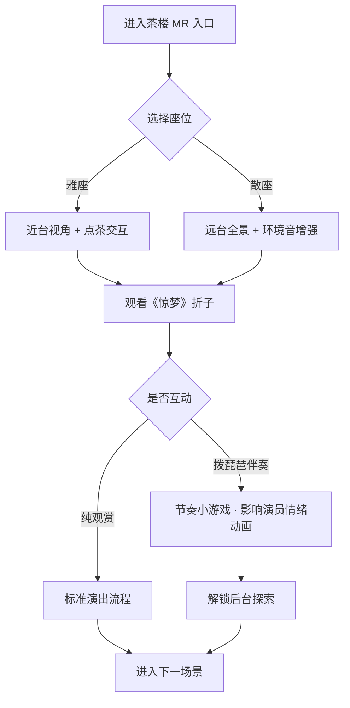

# 昆曲VR剧场 · 内容设计

## 1. 设计目标

昆曲VR剧场旨在突破传统“演员演、观众看”的单向传播模式，借鉴 XR 昆曲《游园·惊梦》的**双轨表演者**机制——观众既是沉浸式体验者，也是参与表演的“虚实融合演员”。通过 MR-VR-MR 虚实切换架构，让受众在体验中完成从“观看”到“参与”再到“理解”的认知闭环。

---

## 2. 叙事架构：MR-VR-MR 虚实切换

### 2.1 整体结构

```
┌─────────────┐     ┌─────────────────────┐     ┌─────────────┐
│  开场 MR    │ ──▶ │   中段 纯 VR 沉浸    │ ──▶ │  结尾 MR    │
│ 认知连接 (5min)│     │ 百年流变 (15-20min)  │     │ 闭环回归 (5min)│
└─────────────┘     └─────────────────────┘     └─────────────┘
```

### 2.2 开场：混合现实（MR）—— 建立认知连接

| 要素 | 设计说明 |
|------|----------|
| **场景** | 用户真实空间叠加半透明昆曲元素（水袖轨迹、戏台轮廓、牡丹花瓣） |
| **引导** | 虚拟“引路人”NPC（可选：杜丽娘/柳梦梅化身）从现实空间“走入”虚拟戏园 |
| **交互** | 用户通过手势或视线确认“进入剧场”，MR 元素随动作产生涟漪反馈 |
| **目标** | 降低 VR 眩晕门槛，建立“我已在此、即将穿越”的心理预期 |

**关键节点**：用户佩戴 Quest 3 后，首先看到自身房间与虚拟戏台边框融合；NPC 递出虚拟“游园帖”，用户接取即触发 VR 全沉浸切换。

### 2.3 中段：纯 VR —— 昆曲百年流变沉浸

采用**时间轴 + 空间轴**双线叙事，用户以“游者”身份穿越四个典型场景：

#### 场景一：清代戏园（1790s 前后）

- **视觉**：高真实度戏园重建（多相机阵列 + 高斯泼溅）
- **听觉**：现场板式、锣鼓经、观众喝彩环境音
- **交互**：可选座位视角（楼座/池座），拨弄虚拟琵琶为《牡丹亭》选段伴奏
- **文化锚点** | 《牡丹亭》全本演出习俗、昆班行会制度

#### 场景二：民国茶楼（1920s–1940s）

- **视觉**：江南茶楼内景，评弹与昆曲并置
- **交互**：**“坐在”茶馆**——选择茶席位置，点虚拟茶品，边品茗边看折子戏
- **分支**：可走向后台，观察妆造与行头整理（参与式模式专属）
- **文化锚点** | 昆曲世俗化传播、市民文化空间

#### 场景三：园林实景（1950s–1980s）

- **视觉**：苏州拙政园/留园式园林，亭榭水榭为天然舞台
- **交互**：跟随虚拟演员漫游“曲径通幽”，在特定位置触发《游园·惊梦》片段
- **双轨机制**：用户可被选为“梦中人”，与虚拟杜丽娘对唱一句（语音识别 + AI 和声）
- **文化锚点** | 园林与昆曲的空间美学、水磨腔身段

#### 场景四：当代数字剧场（2020s）

- **视觉**：生成式 AI 构建的抽象化昆曲意象空间（水袖化为光带、唱腔可视化为粒子流）
- **交互**：用户动作驱动场景变形，成为“数字时代的传习者”
- **文化锚点** | 非遗数字化、青年传承

### 2.4 结尾：回归 MR —— 完成闭环

| 要素 | 设计说明 |
|------|----------|
| **过渡** | VR 场景渐隐，用户房间重新显现，虚拟道具（如游园帖、茶盏）留在 MR 层 |
| **总结** | 可选 NPC 回顾用户旅程中的关键选择与文化知识点 |
| **出口** | 生成个人“昆曲印记”卡片（体验时长、互动次数、解锁场景），支持分享 |
| **目标** | 强化“体验结束但文化连接延续”的传播效果 |

---

## 3. 交互设计

### 3.1 核心交互类型

| 类型 | 描述 | 示例 | 适用场景 |
|------|------|------|----------|
| **虚拟乐器** | 手势/控制器模拟演奏 | 拨弄琵琶、击鼓、敲板 | 戏园、茶楼 |
| **场景漫游** | 自由移动 + 热点触发 | 茶馆就座、园林曲径 | 全场景 |
| **双轨表演** | 用户动作/语音参与演出 | 与虚拟演员对唱、水袖跟练 | 园林、数字剧场 |
| **物件叙事** | 拾取/查看文物式道具 | 戏单、行头、曲谱 | 戏园、后台 |
| **选择分支** | 影响叙事走向（交互叙事版） | 跟师学戏 vs 入座观戏 | A/B 变量 |

### 3.2 交互流程示例：茶馆观戏



### 3.3 无障碍与舒适度

- **移动方式**：默认传送 + 平滑移动可选； seated 模式优先用于茶楼场景
- **晕动症**：MR 开场与结尾各 ≥3 分钟，避免频繁切换；VR 中段提供“休息点”
- **语言**：中文主音轨 + 可选英文字幕/文化注释层（配合文化阐释 A/B 变量）

---

## 4. 双轨表演者机制

参考《游园·惊梦》XR 实践，定义两条并行轨道：

| 轨道 | 角色 | 行为 |
|------|------|------|
| **体验轨** | 沉浸体验者 | 漫游、观看、聆听、选择 |
| **表演轨** | 虚实融合演员 | 伴奏、对唱、身段跟练、影响剧情 |

**融合规则**：

1. 用户完成指定交互（如伴奏成功）→ 虚拟演员向用户“注目”并改变走位
2. 参与式模式下，用户选择可解锁隐藏唱段或后台剧情
3. 系统记录“表演贡献度”，影响结尾 MR 层的个性化反馈

---

## 5. 内容模块清单

| 模块 ID | 名称 | 时长 | 依赖技术 |
|---------|------|------|----------|
| M01 | MR 开场·游园帖 | 5 min | Passthrough API, 手势追踪 |
| M02 | 戏园·琵琶伴奏 | 4 min | 高斯泼溅场景, 物理交互 |
| M03 | 茶楼·就座观戏 | 5 min | 座位锚点, 环境音 |
| M04 | 园林·惊梦对唱 | 6 min | 语音识别, AI 和声 |
| M05 | 数字剧场·意象生成 | 4 min | 生成式 AI, 动作驱动 |
| M06 | MR 结尾·印记卡片 | 5 min | 数据汇总, 分享 API |

**总体验时长**：约 25–30 分钟（可模块化裁剪为 15 分钟精简版）

---

## 6. 与 A/B 测试的衔接

内容设计预留三套可切换配置，详见 [A/B 测试方案](./ab-testing-design.md)：

- **叙事层**：线性时间轴 vs 用户选择分支
- **沉浸层**：纯观赏 vs 参与式（乐器/对唱/后台）
- **阐释层**：无 NPC 讲解 vs 嵌入文化引导模块

各模块通过配置文件（`experience-config.json`）控制开关，便于实验分组部署。
