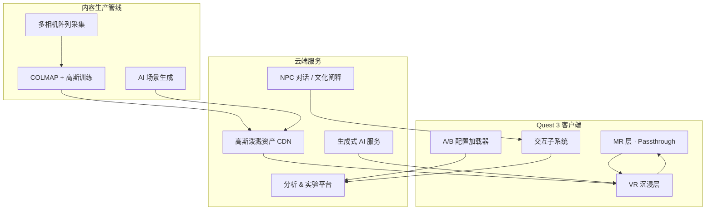

# 昆曲VR剧场 · 技术实现架构

## 1. 技术栈总览

| 层级 | 技术选型 | 用途 |
|------|----------|------|
| **终端设备** | Meta Quest 3 / Quest 3S | 6DoF 追踪、Passthrough MR、手势 |
| **开发引擎** | Unity 2022 LTS + OpenXR | 跨平台 VR/MR 应用 |
| **场景重建** | 多相机阵列 + 3D Gaussian Splatting | 戏园、茶楼、园林高真实度重建 |
| **生成式 AI** | 扩散模型 / 文生场景 API | 数字剧场意象空间、NPC 对话 |
| **音频** | Wwise + 空间音频 | 昆曲唱腔、锣鼓经、环境声 |
| **语音** | 云端 ASR + 音高检测 | 对唱互动、文化问答 |
| **实验平台** | 自研 A/B 分流 + 埋点 SDK | 变量控制与数据采集 |

---

## 2. 系统架构



---

## 3. 高真实度场景重建

### 3.1 采集方案

| 场景 | 相机配置 | 采集要点 |
|------|----------|----------|
| 清代戏园 | 32–64 目阵列 + 无人机 | 台口、藻井、观众席、行头间 |
| 民国茶楼 | 24 目手持 + 固定机位 | 茶桌布局、舞台、窗棂光影 |
| 园林 | 48 目 + LiDAR 辅助 | 亭榭、曲径、水面反射 |

### 3.2 高斯泼溅流程

```
多视角影像 → COLMAP 稀疏重建 → 高斯初始化 → 迭代优化 → .ply / 自定义格式
                                                      ↓
                                            Unity 插件渲染 (Splatting Renderer)
```

**性能目标**（Quest 3）：

- 单场景 splat 数量 ≤ 200 万（LOD 分级）
- 目标帧率 72 FPS（VR）/ 90 FPS（MR Passthrough 叠加时降负载）

### 3.3 与生成式 AI 的融合

- **戏园/茶楼/园林**：以高斯泼溅为主，保证历史场景考据级真实感
- **数字剧场**：生成式 AI 实时生成抽象视觉（ControlNet + 昆曲意象 LoRA）
- **NPC 肤质与服饰**：AI 辅助纹理增强，核心动作仍用动捕数据

---

## 4. MR-VR-MR 切换实现

### 4.1 Meta Quest 3 Passthrough

```csharp
// 伪代码：MR ↔ VR 切换
public class RealityModeController : MonoBehaviour
{
    public enum Mode { MR, VR }
    
    public void TransitionTo(Mode target, float duration)
    {
        // 1. 调整 Passthrough 透明度
        // 2. 同步虚拟场景 alpha
        // 3. 切换追踪空间（Seated ↔ Roomscale）
        // 4. 上报埋点：mode_switch
    }
}
```

| 阶段 | Passthrough | 虚拟场景 | 用户空间 |
|------|-------------|----------|----------|
| MR 开场 | 100% → 30% | 淡入戏台边框 | Roomscale |
| VR 中段 | 0% | 全沉浸 | Roomscale / 传送 |
| MR 结尾 | 30% → 100% | 淡出，保留道具 | Seated 推荐 |

### 4.2 舒适度保障

- 切换过程 ≥2 秒渐变，避免视觉跳跃
- VR 段每 8 分钟提供 MR “透气”可选休息点

---

## 5. 交互子系统

### 5.1 虚拟乐器（琵琶示例）

| 组件 | 实现 |
|------|------|
| 输入 | Quest 3 手部追踪 +  pinch 手势 |
| 物理 | 弦振动简化模型 + 碰撞检测 |
| 输出 | 预录琵琶采样 + 实时音高偏移 |
| 反馈 | 成功段落触发演员动画 State Machine |

### 5.2 场景漫游与就座

- **Navigation**：Unity XR Interaction Toolkit · Teleportation Provider
- **Seated Anchor**：场景内预置 `SeatPoint`，吸附用户视角与控制器
- **热点触发**：Gaze + Pinch 或 Proximity 进入后台/分支

### 5.3 双轨对唱

```
用户语音 → ASR 文本匹配 → 音高/节奏评分 → 合格则触发 AI 和声轨 + 虚拟演员反应
```

---

## 6. 生成式 AI 应用点

| 应用 | 模型/服务 | 说明 |
|------|-----------|------|
| 数字剧场视觉 | Stable Diffusion + 自定义 LoRA | 水袖、牡丹、曲牌意象 |
| NPC 文化讲解 | LLM + RAG（昆曲知识库） | 文化阐释 B 版专用 |
| 动态字幕 | 多语言翻译 API | 跨文化理解辅助 |
| 个性化结尾卡片 | 模板 + 文案生成 | 根据用户行为生成总结 |

**知识库 RAG 来源**：昆曲工尺谱、行话词典、《牡丹亭》评注、非遗档案

---

## 7. A/B 实验技术支撑

### 7.1 配置驱动

```json
{
  "experimentId": "kunqu-vr-2026-q1",
  "variant": "B",
  "narrative": "interactive",
  "immersion": "participatory",
  "interpretation": "npc-guided",
  "modules": {
    "M02_pipa": true,
    "M04_duet": true,
    "cultural_npc": true
  }
}
```

### 7.2 埋点事件（核心）

| 事件名 | 参数 | 用途 |
|--------|------|------|
| `session_start` | variant, locale | 分组统计 |
| `mode_switch` | from, to, scene_id | MR-VR 切换分析 |
| `interaction_complete` | type, success, duration | 参与度 |
| `narrative_choice` | node_id, choice | 交互叙事路径 |
| `cultural_npc_view` | topic_id, dwell_time | 文化阐释效果 |
| `session_end` | total_time, quiz_score | 传播效果 |

---

## 8. 部署与性能

| 项目 | 规格 |
|------|------|
| 安装包大小 | ≤ 2 GB（主包）+ 按需下载场景包 |
| 最低设备 | Quest 3（推荐），Quest 2 降级版（纯 VR，无 MR） |
| 网络 | 离线可玩主流程；AI/NPC 讲解需联网 |
| 更新 | OTA 配置热更新实验变量，无需发版 |

---

## 9. 内容生产排期建议

| 阶段 | 产出 |
|------|------|
| P0 | 单场景 POC（园林 + 高斯泼溅 + 一个交互） |
| P1 | MR-VR-MR 全流程原型 + 线性叙事 |
| P2 | 四场景完整内容 + A/B 配置系统 |
| P3 | AI NPC + 交互叙事分支 + 实验上线 |
